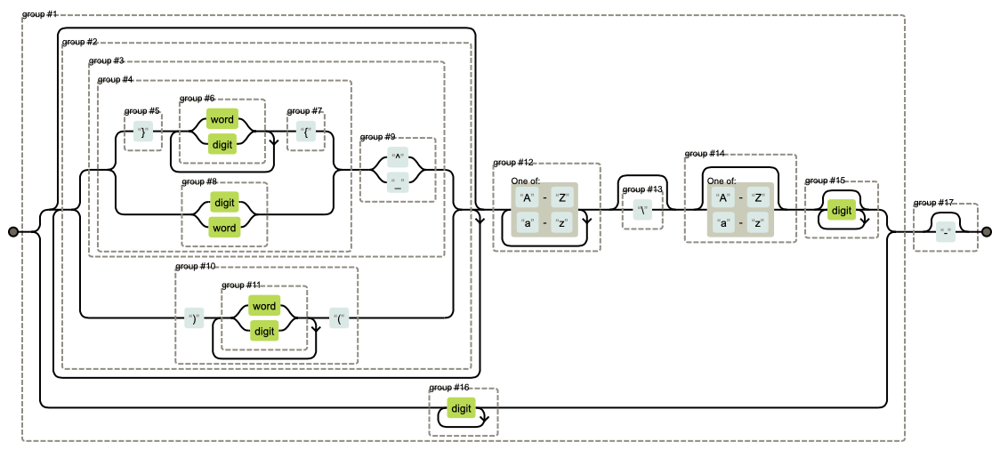

# Snippets for LaTeX

Use in conjunction with [_LatexTools_](https://github.com/SublimeText/LaTeXTools), _LaTeX-cwl_ and _LaTeX Snippets_.

Some snippets are inspired by [gillescastel/latex-snippets](https://github.com/gillescastel/latex-snippets).

Fraction expansion is implemented in ST as a plugin (triggered by double hitting <kbd>/</kbd> in math environments), the Python file [fraction.py](https://github.com/WeixuanZ/ST-snippets/blob/master/LaTeX/fraction.py) should be placed directly under Packages/User/ and add the following to key-map settings.
```JSON
  {
    "keys": [
      "/",
      "/"
    ],
    "args": {
      "file": "Packages/User/fraction.py"
    },
    "context": [
      {
        "key": "selector",
        "operator": "equal",
        "operand": "text.tex.latex meta.environment.math"
      }
    ],
    "command": "fraction"
  }
```
The railroad diagram of the regular expression is shown below

